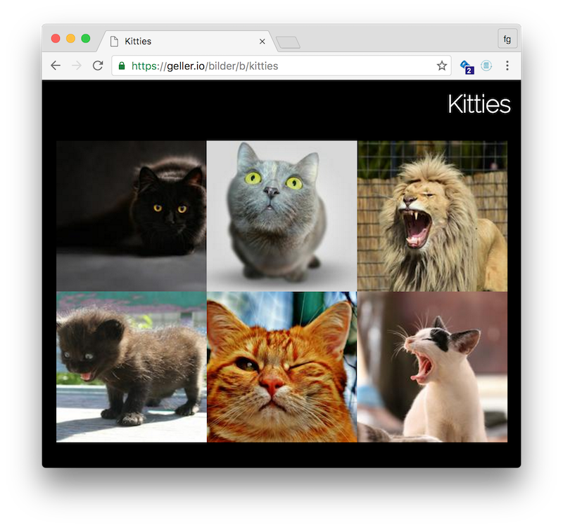
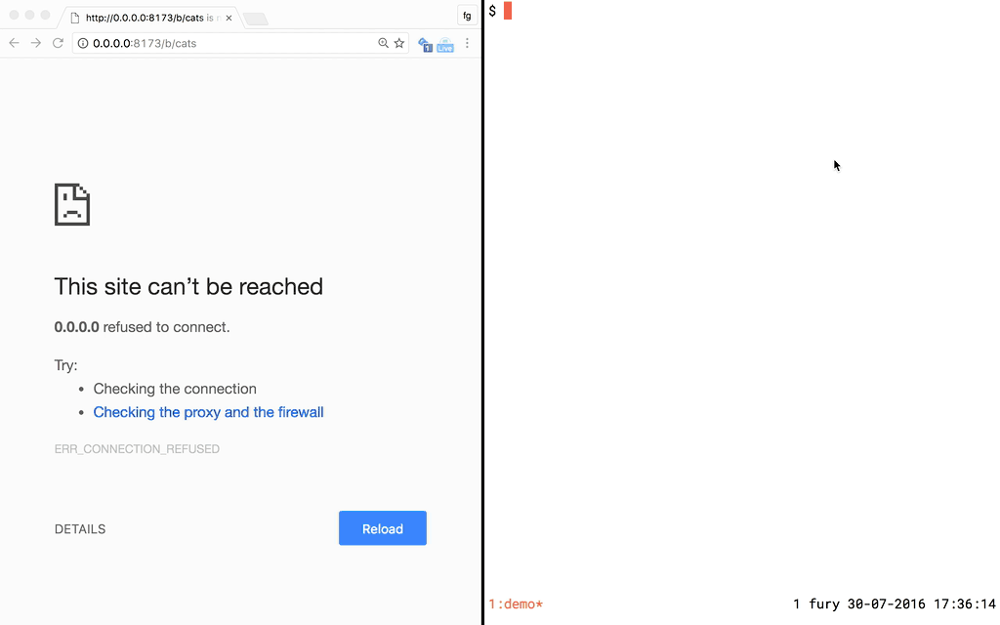

# bilder - web app to host photo albums.

 - Albums are directories with JPEG images that can be managed via rsync/scp.
 - It finds new albums and reloads their configuration and contents dynamically.
 - Thumbnails are generated automatically (filename_thumb.jpg).
 - Basic auth can be enabled per album.
 - Comes as a single binary.

You can either download a [release](https://github.com/fgeller/bilder/releases) or get it via

```
$ go get github.com/fgeller/bilder
```

[Here](https://felix.geller.io/bilder/b/kitties)'s a live demo to click around.

A screenshot:



A screencast:



## Configuration

You can configure bilder via an optional JSON file. You can pass its location to **bilder** on startup:

```
$ bilder -config /path/to/your/config.json
```

It currently supports the following options:

 + `port` *default:* `8173`: This is the port that bilder will serve on.
 + `url-path-prefix` *default:* `""`: This is a prefix that can be added to the assets' paths that are loaded from the browser. This allows bilder to run behind a proxy like nginx (e.g. if you want to use nginx to  terminate the HTTPS connection). Consider the path of the demo linked above: [https://geller.io/bilder/b/kitties](https://geller.io/bilder/b/kitties). In this case nginx proxy passes to bilder under the `/bilder` path which we would set `url-path-prefix` to:
```
location /bilder/ {
    proxy_pass http://localhost:8173/;
}
```
 + `bilder-dir` *default:* `"bilder"`: This is the path of the folder that bilder scans for album directories. In the following example, this directory would contain a single album `kitties`:
```
$ find bilder
bilder
bilder/kitties
bilder/kitties/happy.jpg
```
 + `reload-delay-seconds` *default:* `10`: The time in seconds to wait between scans of `bilder-dir`.
 + `access-log` *default:* `""`: When set to a file name, bilder logs requests against the `/b` path in combined log format to the set file.

This is the JSON file that is used for the [demo](https://geller.io/bilder/b/kitties):
```
{ "bilder-dir": "/home/fgeller/var/bilder", "url-path-prefix": "/bilder" }
```

### Albums

Each sub-directory of the `bilder-dir` directory is considered an album if it contains JPG images.
Only JPG images are currently supported.
You can add more information about the album by adding a `bilder.json` to the directory.
It currently supports the following options:

 + `user` *default:* `""`, `pass` *default:* `""`: If both are non-empty strings, bilder will use them as credentials to enable basic authentication for this album.
 + `title` *default:* `""`: Title that should be set for the album, defaults to the directory name.
 + `captions` *default:* `null`: Map object from file name to caption string (consider the demo example below).
 + `sort-order` *default:* `""`: Identifies sort order for images, supported: `ModTime` (newest first), `Name` (by file name, default).

This is the `bilder.json` file in the `kitties` directory of the [demo](https://geller.io/bilder/b/kitties):
```
{
  "title": "Kitties",
  "captions": {
    "cat-eyes.jpg": "looking",
    "mini-monster.jpg": "rooooar!",
    "yawning.jpg": "Boring!"
  }
}
```

## Credits

All images in the demos are free images from [pixabay](https://pixabay.com/).

bilder uses the following libraries:

 + @dimsemenov's [PhotoSwipe](https://github.com/dimsemenov/PhotoSwipe) for rendering the album.
 + @nfnt's [resize](https://github.com/nfnt/resize) to generate thumbnails.
 + @oliamb's [cutter](https://github.com/oliamb/cutter) to crop thumbnails to a centered square.
 + @satori's [go.uuid](https://github.com/satori/go.uuid) to generate a random session ID.
 + @gorilla's [handlers](https://github.com/gorilla/handlers) for logging requests.
